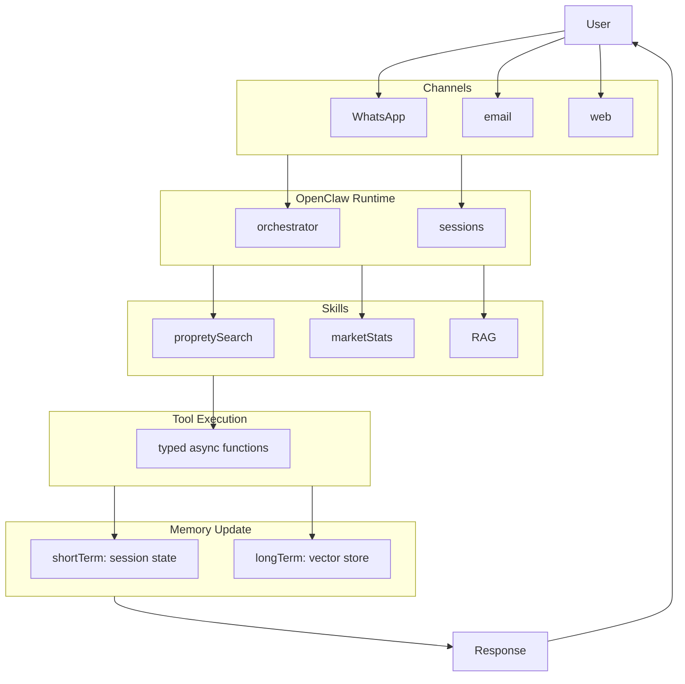

```mermaid
flowchart TD
    U[User]
    R[Response]

    subgraph Channels
        WA[WhatsApp]
        EM[email]
        WEB[web]
    end


    subgraph OR[OpenClaw Runtime]
        O[orchestrator]
        S[sessions]
    end


    subgraph Skills
        PS[propretySearch]
        MS[marketStats]
        RAG[RAG]
    end

    subgraph TE[Tool Execution]
        TAF[typed async functions]
    end

    subgraph MU[Memory Update]
        ST[shortTerm: session state]
        LT[longTerm: vector store]
    end


    U --> WA & EM & WEB
    Channels --> O & S
    OR --> PS & MS & RAG
    Skills --> TAF
    TE --> ST & LT
    MU --> R
    R --> U


```
