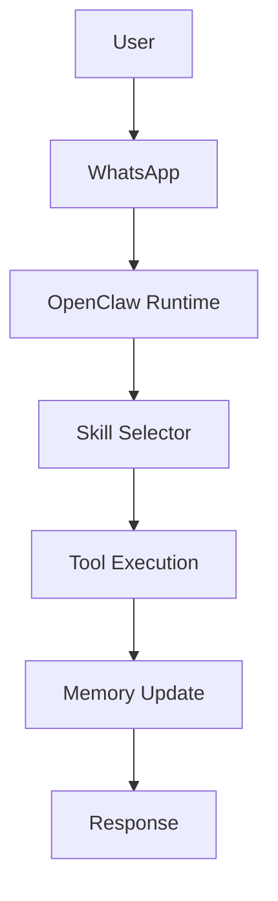

```mermaid
flowchart TD
    User --> WA[WhatsApp]
    WA --> OR[OpenClaw Runtime]
    OR --> SS[Skill Selector]
    SS --> TE[Tool Execution]
    TE --> MU[Memory Update]
    MU --> R[Response]


```
