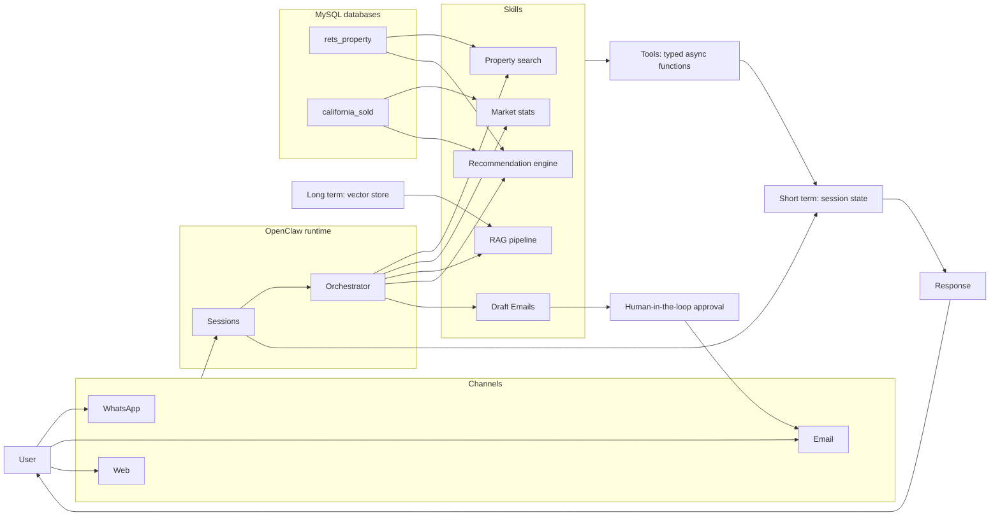

```mermaid
%% User → WhatsApp → OpenClaw Runtime → Skill Selector → Tool Execution → Memory Update → Response → User

flowchart LR
    U[User]
    ST[Short term: session state]
    LT[Long term: vector store]
    TE[Tools: typed async functions]
    R[Response]
    H[Human-in-the-loop approval]
    subgraph Channels
        WA[WhatsApp]
        EM[Email]
        WEB[Web]
    end

    subgraph OR[OpenClaw runtime]
        O[Orchestrator]
        S[Sessions]
    end
    subgraph Skills
        PS[Property search]
        MS[Market stats]
        RAG[RAG pipeline]
        REC[Recommendation engine]
        DE[Draft Emails]
    end
    subgraph DB[MySQL databases]
        RP[rets_property]
        CS[california_sold]
    end

    U --> WA & EM & WEB
    Channels --> S --> O --> PS & MS & RAG & REC & DE
    S --> ST
    LT --> RAG
    Skills --> TE --> ST
    RP --> PS
    CS --> MS
    RP --> REC
    CS --> REC
    DE --> H --> EM
    ST --> R --> U

```
